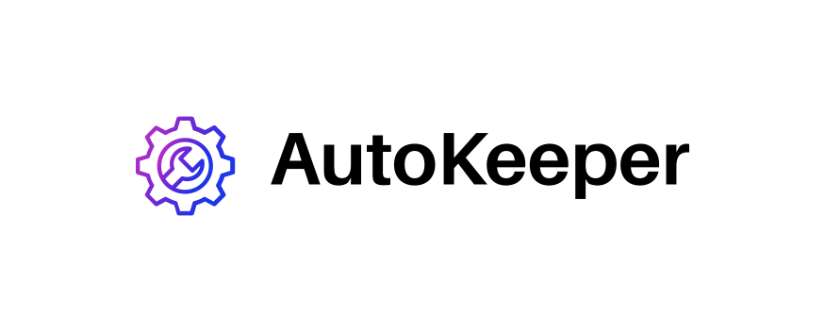
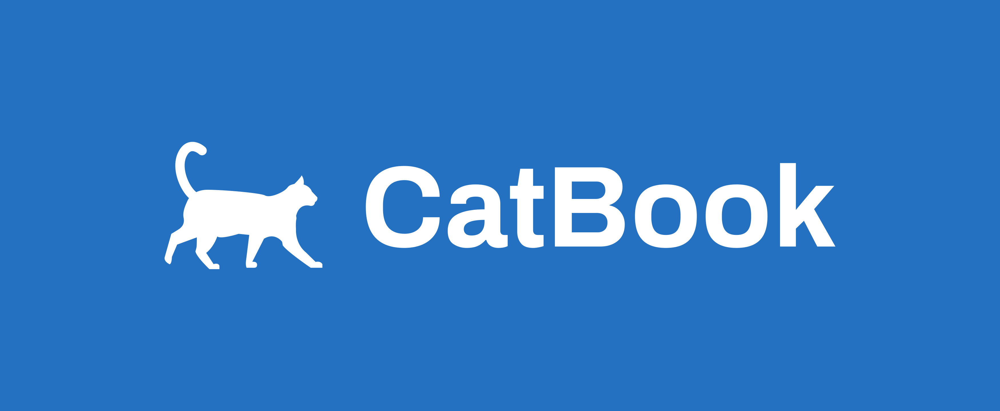
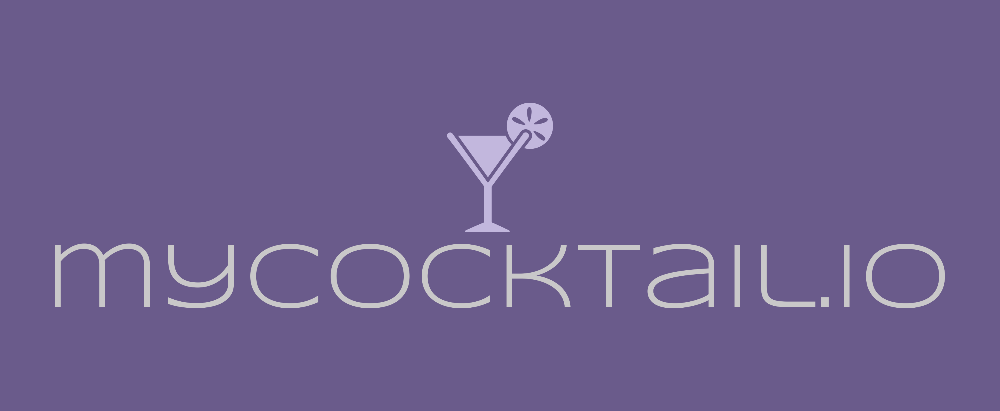
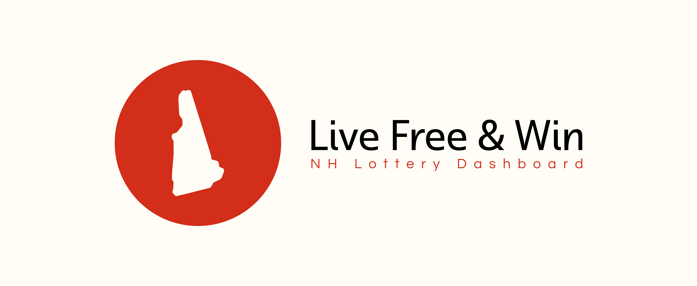

---
<h1 align="center">Eric Robicheau</h1>

  

       

  

 

  

  Software Engineer, Kinesiology Graduate, health and wellness enthusiast. I enjoy the thoughtful and pragmatic approach to practical and impactful solutions that software development provides. Check out some of my work below.

  See [my website](https://ericrobicheau.com) for more information and to get in touch!
  

 

<h2 align="center">FEATURED PROJECTS</h2>
<table>
  <tr>
   
  <td width="50%" valign="top">
      <h3 align="center">AutoKeeper</h3>
         
        
          

   

  
<strong>Node.js | Express.js | MongoDB</strong> - A comprehensive vehicle maintenance web app that allows users to efficiently log and track their vehicles' maintenance records.

  

  </td>

  <td width="50%" valign="top">
      <h3 align="center">CatBook</h3>
         
      
         

   

  

          
  

        
<strong>Node.js | Express.js | MongoDB</strong> - A trendy full-stack platform resembling a social network for cat owners, serving as a feline-friendly counterpart to a popular social media app.

  

  </td>

  </tr>
  <tr>
    
    
  <td width="50%" valign="top">
      <h3 align="center">myCocktail.io</h3>
         
        
         

  

   
  
<strong>React.js | Node.js | Express.js</strong> - A powerful, lightweight front end application that empowers users to effortlessly search a diverse cocktail database.

  
  

  </td>
    <td width="50%" valign="top">
      <h3 align="center">Live Free & Win</h3>
         
      
         
      
  

  

  

        
  

        
<strong>Python | Flask </strong> - A dynamic dashboard showcasing New Hampshire Lottery data, delivering users rapid insights and statistics.

    
   
 
  </td>
  
</table>
 

 <h2 align="center">TECHNOLOGIES</h2>

<h3 align="center">Languages</h3>

   

<h3 align="center">Frameworks & Runtimes</h3>

 

<h3 align="center">Other Tools</h3>

       

 

 
<h2 align="center">CONNECT</h2>

      

  

