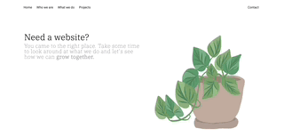

---
<h1 align="center">Eric Robicheau</h1>

  
  
  

 

Software Engineer, Kinesiology Graduate, health and wellness enthusiast. I enjoy the thoughtful and pragmatic approach to practical and impactful solutions that software development provides. Check out some of my work below.

See [my website](https://ericr.netlify.app/portfolio.html) for more information and to get in touch!

 

<h2 align="center">PROJECTS</h2>

---

<table>
  
  <tr>
    <td width="50%" valign="top">
      <h3 align="center">Personal Site</h3>
         
        
         
        

          
    
  
      

        
<strong>HTML5, CSS3, JavaScript</strong> - A landing page serving as a hub for Web Development services and for a developer portfolio featuring recent websites and projects along with bios and contact information.

    </td>
    <td width="50%" valign="top">
      <h3 align="center">NASA Picture of The Day</h3>
         
      
         
        

          
  
  
      

        
<strong>HTML5, CSS3, JavaScript</strong> - A web application utilizing NASA's 'Picture of the Day' API to return users with a picture or media of the day based on a selected date.

    </td>
  </tr>
  <tr>
    <td width="50%" valign="top">
      <h3 align="center">Pokemon Color Picker</h3>
         
        
         
        

          
    
  
      

        
<strong>HTML5, CSS3, JavaScript</strong> - A lightweight Pokemon-themed app allowing users to modify web page colors based on their preferred (gen 1) Pokemon starter.

    </td>
  </tr>
</table>
 

 <h2 align="center">TECHNOLOGIES</h2>

---

 

    
    
    
    
    
    
    
    
    
    
    

 

---

<h2 align="center">CONNECT</h2>

---

 

  
  
  
  

